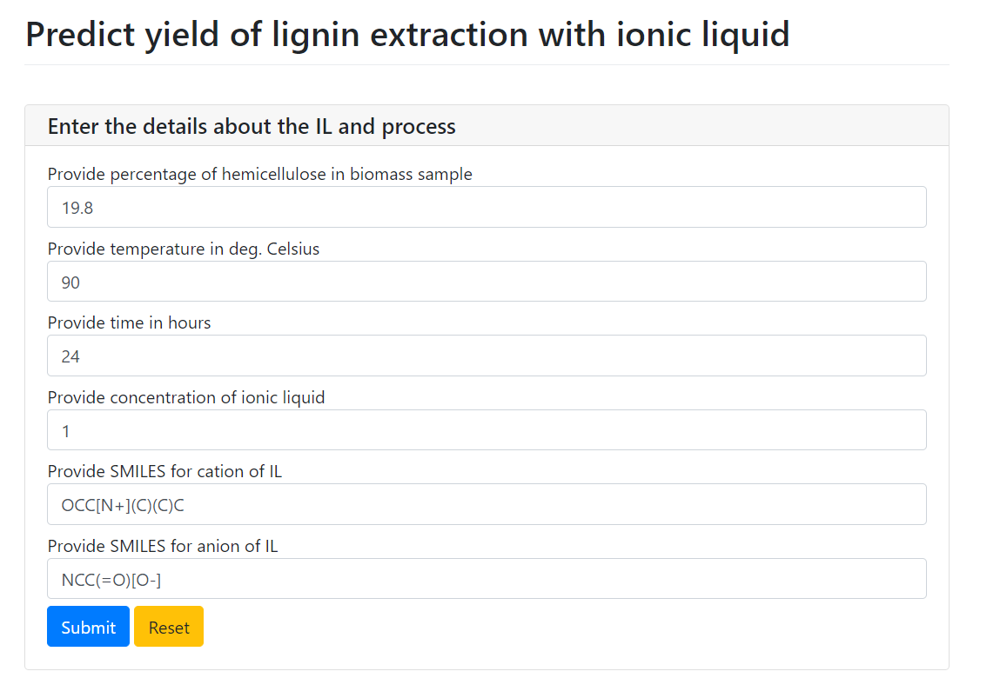

# Lignin ILs Modeling
 
This repo contains codes to reproduce our work on modeling lignin extraction with ionic liquids using machine learning approach.

Corresponding author: Karol Baran (GdańskTech), karol.baran[at]pg.edu.pl

Manuscript status: submitted (2024)

The online version of the app using the proposed model is [available at this address](https://labilspg.pythonanywhere.com/)

## Project description
Lately, lignin has been regarded as a renewable raw material for the synthesis of chemicals and materials to substitute petrochemical resources. Consequently, it is crucial to optimize the technological procedures for extracting it from natural sources, such as biomass. In this study, an examination of the utilization of machine learning-based quantitative structure-property relationship (QSPR) modeling for the initial processing of lignin recovery from herbaceous biomass using ionic liquids (ILs) is delineated. It is assumed that the models are trained using experimental data obtained from original publications on the subject, and molecular descriptors of the ionic liquids are employed to convey structural information. The research explores the influence of both ILs' chemical structure and process parameters on the effectiveness of lignin recovery. 

## HOW-TO - Prediction App Usage
The online version of the app is [available at this address](https://labilspg.pythonanywhere.com/). One can also download [the desktop app for fast ML yield prediction](https://github.com/kbarn411/Lignin-ILs-Modeling/releases/tag/v1.0) from this repo. Executable can be run on Windows devices.

In order for the app to work properly it is important to:
1. download [model weights](https://github.com/kbarn411/Lignin-ILs-Modeling/blob/main/app/xgb_model.joblib)
1. in the same folder keep [the downloaded app executable file](https://github.com/kbarn411/Lignin-ILs-Modeling/releases/tag/v1.0)

Input fields are prefilled with some exemplary values that should be changed by the user in accordance with their needs. After clicking "Submit" a short input summary and predicted yield are shown. 

## HOW-TO - Reproduce Work with Codes
- note_1 - this notebook contains all the necessary codes to calculate molecular representation (molecular descriptors and molecular fingerprints) for modeling. After running the codes, one would obtain a .csv file with all MDs and MFs available. Input data could be obtained from Table S2 ESI or the original raw file from authors by request.
- note_2 - this notebook contains codes to perform modeling and models' interpretation/validation. One should start with a .csv file obtained from note_1, however, usage of data from Table S4 ESI is also possible (however not preferable).
